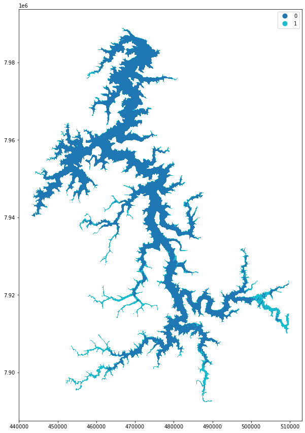

# Detecção de anomalias
Códigos e experimentos para o desenvolvimento dos modelos de detecção de anomalias para o projeto de avaliação da qualidade de água, financiado pela CEMIG.

Especificamente para essa parte de detecção de anomalias, foi desenvolvido um artigo científico que assim que publicado, seu link será disponibilizado aqui. O repositório aqui presente faz referência ao artigo citado.

Existe um notebook disponível no Colab onde é possível carregar um modelo pré-treinado, carregar o dataset que contém a represa de Três Marias e fazer a inferência de cada ponto no modelo de detecção de anomalias. Em seguida, o mapa pode ser visualizado.

Colab notebook para inferência: https://colab.research.google.com/drive/1hO4pU-Yssrv3sq7NN9h8flDn_7Qo6dNx

Arquivos (modelo pré-treinado e dataset da represa): https://drive.google.com/drive/folders/1o2aHSjao1exmgb-STiqhJflJ36wnBf5l

# Contexto da Pesquisa

Essa pesquisa tem como objeto de exploração métodos de Machine Learning especializados em detecção de anomalias (SVM One Class e Florestas Isoladas) a partir do processamento de dados de imagens de satélite (Sentinel-2), a fim de identificar pontos geográficos com elevada concentração de turbidez no Reservatório de Três Marias. Os métodos SVM One Class e Florestas Isoladas registraram níveis de desempenho similares, sendo a métrica F1-score obtida de 94,54\% e 96,15\%, respectivamente, com destaque para a acurácia de Florestas Isoladas (96,15%) e suas baixas taxas de falsos positivos/negativos (3,85%). Os mapas de identificação de anomalias gerados por meio dos modelos ratificaram a aplicabilidade dos métodos de detecção no diagnóstico de reservatórios em contextos hidrológicos distintos (seca e chuva), identificando com eficácia localidades com níveis de turbidez anômalos.

A imagem abaixo ilustra a represa de Três Marias. Após o modelo ter sido treinado, todos os pontos obtidos pela imagem de satélite da represa foram preditos pelo modelo e consequentemente classificados. A classe '0' representa uma qualidade de água que possui baixa turbidez (dado normal), enquanto a classe '1' uma alta turbidez (anomalia). É possível perceber que os dados anômalos (alta turbidez) são encontrados próximo as margens da represa, o que faz sentido, uma vez que a água é realmente mais escura nesses pontos do mapa.

## Diretório 'codigos-datasets-experimentos-resultados'

Nesse diretório é possível encontrar todos os códigos implementados, datasets e experimentos realizados, além dos resultados obtidos, no que diz respeito ao desenvolvimento de um modelo de aprendizado de máquina usando a abordagem de detecção de anomalias.

A justificativa para o uso da abordagem de detecção de anomalias é pelo fato de que para o problema proposto de avaliação da qualidade da água, encontra-se um desbalanceamento claro entre os rótulos de água "boa" e água "ruim".

Cada subdiretório é nomeado por uma data de origem. No decorrer do projeto novos datasets foram obtidos e diferentes filtros de pré-processamento nos dados foram aplicados. Dessa forma, em cada um dos subdiretórios encontram-se diferentes arquivos com os dados e consequentemente os arquivos com extensão '.ipynb' que armanezam as implementações em Python realizadas. Dentro dos arquivos '.ipynb' situa-se os códigos, a metodologia dos experimentos bem como os resultados alcançados.

## Arquivo 'Demo_deteccao_anomalias.ipynb'

O arquivo 'Demo_deteccao_anomalias.ipynb' é um Jupyter Notebook que permite que qualquer pessoa possa fazer o treinamento e a inferência de dois modelos de aprendizado de máquina (SVM One Class e Florestas Isoladas) a partir de um dataset contendo amostras com 12 parâmetros (bandas) de entrada e sua respectiva classe binária.

O passo a passo para a execução do Jupyter Notebook é:

1) Carregamento das bibliotecas.
2) Carregamento do dataset.
3) Limpeza, pré-processamento e análise do dataset.
4) Divisão do dataset em subconjuntos de treino e teste.
5) Aplicação da técnica SMOTE para aumento de dados.
6) Padronização dos dados.
7) Definição dos parâmetros para o método SVM One Class.
8) Treinamento de diferentes modelos para variadas combinações de parâmetros empregando o método SVM One Class.
9) Avaliação e seleção do melhor modelo obtido para o método SVM One Class.
10) Definição dos parâmetros para o método Florestas Isoladas.
11) Treinamento de diferentes modelos para variadas combinações de parâmetros empregando o método Florestas Isoladas.
12) Avaliação e seleção do melhor modelo obtido para o método Florestas Isoladas.
13) Seleção do melhor modelo treinado dentre todas combinações de parâmetros e métodos de aprendizado de máquina avaliados.
14) Aplicação do teste estatístico de McNemar para verificação sobre a existência de diferença significativa entre os modelos de aprendizado treinados.
15) Carregamento do dataset (para esse caso contendo toda a represa de Três Marias, representado pelos pixels extraídos da imagem de satélite).
16) Inferência dos dados no melhor modelo obtido.
17) Geração do mapa.
18) Exportação do mapa em formato 'shapefile'.
